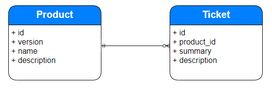

Resource
In our example scenario, a product resource represents a master list of products. Each product has an id, version, name, and description uniquely identified by the id. Each product can have many issues/bugs associated with it. A ticket resource can be used to represent each issue/bug. Each ticket will have an id, product_id, summary, and description.

endpoints:
GET /api/tickets  -> Retrieve a list of all tickets with details
GET /api/tickets/{id}  -> Retrieve details of specific ticket
POST /api/tickets  -> Create a new ticket
PUT /api/tickets/{id} -> Update the details of the ticket by id
DELETE /api/tickets/{id} -> Delele ticket by id
